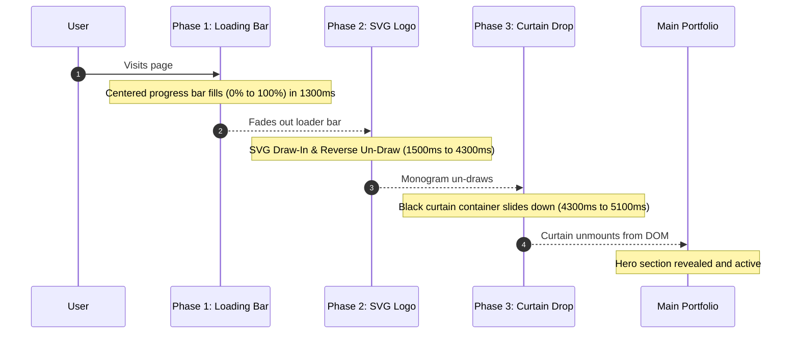

# Application Flow & Interactions

This document outlines the visual and logic lifecycle of the user's experience as they visit and interact with the portfolio.

---

## 1. Page Entrance Timeline (The Preloader)
The entrance sequence uses Anime.js v4 to coordinate a three-phase transition:

- **Phase 1: Progress Indicator**: A minimalist loading bar (260px × 3px) fills in the absolute center of the screen with Signal Red (`#e5341f`), then fades out.
- **Phase 2: Monogram Trace**: SVG vector text of `AAYUSH` (top-left quadrant) and `MITTAL` (bottom-right quadrant) are drawn in using a custom stroke path with `strokeDashoffset` and then un-drawn in reverse.
- **Phase 3: The Reveal**: The full-screen black overlay container drops downward (`translateY: ['0%', '100%']`) using an `inOutExpo` ease over 800ms, revealing the Hero underneath.

---

## 2. Scroll Lifecycle (Lenis & GSAP)
- **Lenis Smooth Scroll**: Instantiated at the layout root. Intercepts mouse and touch scrolling to inject uniform momentum, smoothing out differences across browsers and hardware.
- **Section Jumps**: Standard anchor links (`#work`, `#services`, etc.) trigger smooth programmatic scrolls managed by Lenis to ensure uniform velocity curves.
- **Sticky Nav Header**: The 68px header remains fixed. When scroll offset is greater than 100px, a border or background tint registers to set visual boundary limits.

---

## 3. Component Interaction Modes

### 3.1. GitHub Contribution Matrix Toggle
The contribution matrix component has two modes managed via local React state:
1. **Live Commits Mode**: Fetches and renders actual GitHub activity data for the user `@AayushM0` over the last 52 weeks. Commits are rendered in graded green/acid lime dots. Hovering over a dot reveals the commit count and timestamp.
2. **Pixel Art Mode ("AAYUSH")**: Renders a fixed 7-row by 52-column grid representing spelling out the word **"AAYUSH"** in active acid lime/Signal Red dots against a dark background.
- *Interactive Element*: Toggled via a tactile mode-switch header inside the matrix container.

### 3.2. Services Hover Inversion
- *Layout*: 4 horizontal rows.
- *Interaction*: Hovering over a row triggers a CSS transition that inverts the colors (background turns pure black, borders light up, text swaps).

### 3.3. Stacking Card Deck (StackedWork)
- *Scroll Triggering*: As the user scrolls through the featured works section, cards stack on top of one another using a parallax-offset scroll curve.
- *Layout*:
  - **Row 1**: Full width card (LACE).
  - **Row 2**: 50/50 split cards (GramConnect & Design Showcase).
  - **Row 3**: 50/50 split cards (DeployIT & Commercial Frontend).

---

## 4. Scroll Progress Widget (Ruler & Needle)
- Located in the bottom-right corner.
- Translates the overall document scroll ratio (0% to 100%) into the movement of a needle along a vertical ruler scale.
- Employs a custom GSAP scrub to keep the needle movement fluid.
