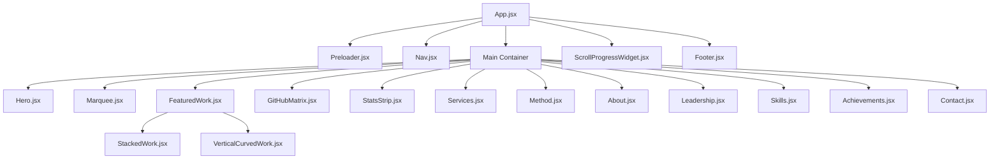

# System Architecture & Component Specification

## 1. High-Level Component Map

The following Mermaid diagram maps the layout hierarchy and component relationships inside `App.jsx`.



---

## 2. Component Design Specifications

### 2.1. Preloader (`Preloader.jsx`)
- **Engine**: Anime.js timeline (`anime.timeline()`).
- **State Integration**: Managed at the root `App.jsx` level via an `isLoaded` boolean hook. Once the Anime.js timeline triggers `complete()`, it updates `isLoaded = true` causing the preloader to unmount and setting page scroll active.
- **Visual Nodes**: Fenced in a fixed `#000000` layout block with absolute-centered content tags.

### 2.2. Navigation (`Nav.jsx`)
- **Layout**: Consists of a static red signal accent stripe (labeled `"Open to freelance work"`) and a sticky 68px main header.
- **Links**: Navigates using classic window anchors targeting matching section IDs.

### 2.3. Featured & Stacked Work (`FeaturedWork.jsx` & `StackedWork.jsx`)
- **Scrub Engine**: GSAP `ScrollTrigger` with Lenis smooth scroll tracking.
- **Card Distribution**:
  - Row 1: 100% full-width main deck.
  - Row 2: 50/50 split layout.
  - Row 3: 50/50 split layout.
- **Curve Math**: Projects scroll triggers capture scroll depth and adjust horizontal translate parameters along parabolic curves:
  \[yOffset = \text{amplitude} \times \sin(t \times \pi)\]

### 2.4. GitHub Activity Heatmap (`GitHubMatrix.jsx`)
- **Data Hook**: Custom `useEffect` hook performing `fetch()` calls to the GitHub contributions API.
- **State Variables**:
  - `data`: Stores parsed weekly commit arrays.
  - `isLoading`: Loading state overlay.
  - `mode`: Toggles between `live` and `pixel` to render commits vs. spelling matrix.
- **Grid Layout**: A responsive SVG container structured into 7 rows of 52 columns of individual `<rect>` modules.

---

## 3. Data & Config Pipelines

```
[ content.js ] ────(Static Config Import)───► [ React Components ]
                                                     ▲
                                               (Fetch JSON)
                                                     │
                                         [ GitHub Contributions API ]
```

- **Static Content**: Loaded synchronously from `content.js` at runtime. Components reference configuration objects to avoid manual layout injection.
- **Dynamic Content**: Fetched asynchronously on client initialization. If the response fails, it catches exceptions gracefully to maintain site operation.
