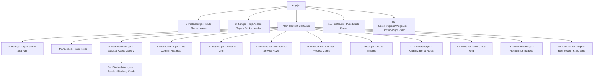

# 📐 AAYUSH MITTAL — Portfolio Architecture, Structure & Content Specification

> **Full Production Blueprint & Data Catalog**  
> **Version:** 1.0.1 · Solo Developer Edition  
> **Tech Stack:** Vite 8 · React 19 · GSAP 3 · Lenis 1.3 · Anime.js 4 · Tailwind CSS  

---

## 📑 Table of Contents

1. [Design System & Color Tokens](#1-design-system--color-tokens)
2. [Full Page Component Hierarchy](#2-full-page-component-hierarchy)
3. [Component-by-Component Specifications](#3-component-by-component-specifications)
4. [Master Content Data & Placeholders (`content.js`)](#4-master-content-data--placeholders-contentjs)
5. [Motion & Animation Mechanics](#5-motion--animation-mechanics)
6. [File Tree Map](#6-file-tree-map)

---

## 1. Design System & Color Tokens

The portfolio is built on a **Neo-Brutalist Charcoal & Signal Red Dual-Accent Token System**.

| Token Name | Hex Code | Visual Role & Usage |
|---|---|---|
| `--bg-base` | `#1A1A18` | Primary Charcoal background for all main sections |
| `--bg-black` | `#0A0A0A` | Pure Black background for panels, cards & footer |
| `--signal-red` | `#e5341f` | **Primary Loud Accent**: Contact section, monogram, active ticks, tags |
| `--signal-lime` | `#D7FF3F` | Secondary accent highlight for badges & stats |
| `--fg` | `#F5F3EE` | Off-white primary text for headings & body copy |
| `--fg-muted` | `#9A9A92` | Warm gray for captions, subtitles, and JetBrains Mono tags |
| `--fg-on-red` | `#F5F3EE` | Off-white text rendered over Signal Red backgrounds |
| `--border` | `#3A3A36` | 2px Soft Charcoal structural border hairline |

---

## 2. Full Page Component Hierarchy



---

## 3. Component-by-Component Specifications

### 1. `Preloader.jsx` (Multi-Phase Entrance Sequence)
- **Phase 1 (0ms – 1500ms)**: Centered minimalist 260px × 3px loading bar fills from 0% to 100% width (`#e5341f`), then fades out.
- **Phase 2 (1500ms – 4300ms)**: Renders a 2-line stacked SVG (`AAYUSH` top-left, `MITTAL` bottom-right, inner corners meeting at 50% screen center). Animates a vector draw-in stroke (`strokeWidth="9"`) followed by a reverse-trace un-draw using Anime.js v4.
- **Phase 3 (4300ms – 5100ms)**: The full-screen `#000000` black curtain drops downward (`translateY: 0% ➔ 100%`) off-screen, revealing the Hero section underneath.

### 2. `Nav.jsx` (Top Accent Tape & Sticky Header)
- **Top Tape**: Signal Red band displaying `"Open to freelance work"`.
- **Sticky Header**: 68px sticky bar featuring:
  - Monogram `A` box (`#e5341f` background with `#F5F3EE` letter).
  - `AAYUSH MITTAL®` wordmark.
  - Mono navigation links (`Work`, `Activity`, `Services`, `Method`, `About`, `Contact`).
  - `Start a project` pill CTA (`mailto:aayushmittal620@gmail.com`).

### 3. `Hero.jsx` (Main Viewport Showcase)
- **Meta Row**: Live status indicator (`✳ Open to freelance work · 5 Projects Shipped`).
- **Giant Headline**: `Work that refuses to blend in.` (word `refuses` highlighted in Signal Red).
- **Lower Split Band**: 7-col blurb & dual CTA on left + 5-col canvas artwork block (`.hardshadow-red`) and 2-cell stat pair (`5 Projects Shipped` / `2+yr Building in Public`) on right.

### 4. `Marquee.jsx` (Scrolling Project & Stack Ticker)
- 26s infinite CSS keyframe horizontal ticker displaying real project names & tech stack tags (`LACE`, `GramConnect`, `DeployIT`, `Vite 8`, `React 19`, `GSAP`, `Node.js`, `Python`, `MCP`, `FastAPI`, `MongoDB`, `Tailwind CSS`).

### 5. `FeaturedWork.jsx` & `StackedWork.jsx` (Scroll-Linked Card Stacking)
- **Row-by-Row Layout**:
  - **Row 1 (100% Full Width)**: `LACE` · Main System & Architecture (`[ AI SYSTEM ]` · `2026`).
  - **Row 2 (50 / 50 Split)**: `GramConnect` · Civic Protocol (`[ FULL-STACK ]` · `2025`) + `Frontend Design Showcase` (`[ CLIENT PROJECT ]` · `2025`).
  - **Row 3 (50 / 50 Split)**: `DeployIT` · CLI Deployer (`[ TOOLING ]` · `2025`) + `Commercial Frontend Project` (`[ CLIENT PROJECT ]` · `2026`).

### 6. `GitHubMatrix.jsx` (Live Commit Heatmap)
- Live GitHub API integration (`https://github-contributions.vercel.app/api/v1/AayushM0`).
- Dynamic total contribution counter from API + Pixel "AAYUSH" mode toggle.

### 7. `StatsStrip.jsx` (Metrics Grid)
- 4-up metric strip: `5` Projects Shipped, `3` Leadership Roles, `30+` Students Mentored, `2+yr` Building in Public.

### 8. `Services.jsx` (What I Do)
- Heading: **`What I Do`**. 4 numbered service rows that invert background to Pure Black on hover.

### 9. `Contact.jsx` (Full-Bleed Signal Red Section)
- Headline: **`Let's ship something loud.`**
- Eyebrow: `[ START A PROJECT ]`
- Info grid: `LOCATION` (`IIIT Kota / India`) & `AVAILABILITY` (`Open to freelance work`).

---

## 4. Master Content Data (`content.js`)

```javascript
export const siteConfig = {
  name: "Aayush Mittal",
  brand: "Aayush Mittal",
  tagline: "Full-stack builder who ships — from client-ready frontend work to AI-native developer tooling.",
  status: "Open to freelance work",
  resumePath: "/AayushResume.pdf",
  email: "aayushmittal620@gmail.com",
  github: "https://github.com/AayushM0",
  linkedin: "https://linkedin.com/in/aayush-mittal620",
  location: "IIIT Kota / India",
  hours: null,
};
```
